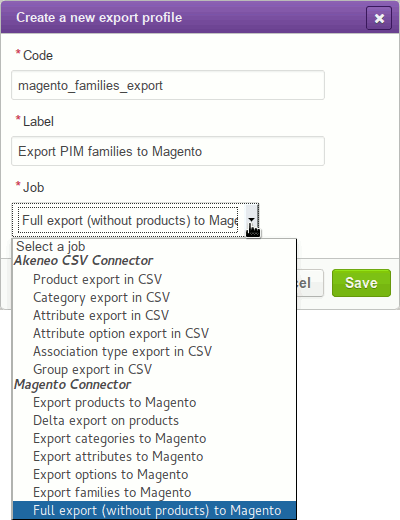
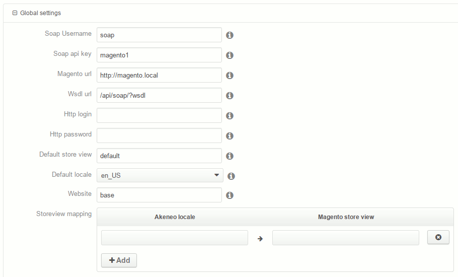

# User Guide for the Magento connector bundle

This user guide is primarily focused on the Magento connector bundle v1.1, but hints are presented for the development version (which will be v1.2).

## Mandatory attributes

The following Magento's attributes are mandatory for Magento and have to be created or mapped in Akeneo:

- name
- price
- weight
- description
- short_description
- tax_class_id

Also note that you should NEVER try to change/update attributes on Akeneo that are of system type on Magento side (except if you really want to completely break your Magento install).

You can now create export jobs.

## Exporting structure

First, you need to export Akeneo's structure (families, attributes, associations, etc.) to Magento, in order to have the same organisation on both sides.

Go to `Spread > Export profiles` and create a new `magento_full_export` profile.

**Note**: This profile doesn't exist anymore in v1.2. Instead, you have to create a `magento_attribute_export` and run it, then create and run a `magento_category_export`.

*Magento full export creation*:

Then complete the global settings of the configuration. You only have to complete basic information about Magento, and cannot complete any storeview or attribute mapping for the moment.

*Example of a basic export configuration*:

Once completed, save the configuration, and edit it again. The Magento connector bundle now knows your Magento install and can propose you the mapping. Complete categories and attributes mapping, save the profile again, and run it. Now you have your Akeneo structure in Magento.

*Complete export configuration*:

### Important!

The Magento's default store view code (which is "base", configured in the "Website" field in export profiles) should not be changed, as it can lead to wrong behavior from the connector.

The store view mapping is not a requirement if your Akeneo locales share the same names than your Magento store views. If not, then you have to map them. Note that you already have mapped a default Akeneo locale with a default Magento store view, so you only have to map additional locales. You are now ready to export your products.

Remember that export profiles, once launched, run as background tasks, so you don't have to wait until structure export finishes to start creating you product export (but of course you have to wait and check it succeeds before running the product export). You can check if export succeeds (or fails and then see why) by going to `Spread > Exports history`.

## Exporting products

Create a new export profile and select `magento_product_export`. Complete the global settings the same way you complete them for the structure export. Save the profile and edit it again. You can now map additional store views, categories, and attributes.

Optionally, you can also choose if the product is visible or not on Magento, the currency, thumbnails, associations…

*Product export extra configuration*:

# Not supported

## Attribute groups update

In Akeneo, attribute groups are only related to attributes. It is not the case on Magento where they depend on attribute sets. The SOAP API define the group of an attribute when adding it to an attribute set.

The problem is that the SOAP API only proposes [methods](http://www.magentocommerce.com/api/soap/catalog/catalogProductAttributeSet/productAttributeSet.html) to add and remove attributes from attribute set, nothing to update them, and the [Product Attributes methods](http://www.magentocommerce.com/api/soap/catalog/catalogProductAttribute/catalogProductAttribute.html) don't handle attribute groups.

So if you want to perform an update, you'd have to remove and add again the attributes you want to change the group, which is not possible if there is already products using these attributes.

## Specific attribute

In Akeneo, you have the possibility to add a specific attribute (which is not related to the product family) to a product. As this is not possible in Magento (an attribute has to be in an attribute set), if you do so, the specific attribute will not be exported to Magento, and the product export will fail.

So don't add specific attributes to products you want to export to Magento.
