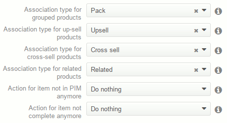

# User Guide for the Magento Connector Bundle

## Mandatory attributes

The following Magento's attributes are mandatory for Magento and have to be created or mapped in Akeneo:

- name
- price
- weight
- description
- short_description
- tax_class_id

You can now create export jobs.

## Exporting structure

First, you need to export Akeneo's structure (families, attributes, associations, etc.) to Magento, in order to have the same organisation on both sides.

Go to `Spread > Export profiles` and create a new `magento_full_export` profile.

*Magento full export creation*:

Then complete the global settings of the configuration. You only have to complete basic information about Magento, and cannot complete any storeview or attribute mapping for the moment.

*Example of a basic export configuration*:

Once completed, save the configuration, and edit it again. The Magento connector bundle now knows your Magento install and can propose you the mapping. Complete categories and attributes mapping, save the profile again, and run it. Now you have your Akeneo structure in Magento.

*Complete export configuration*:

The store view mapping is not a requirement if your Akeneo locales share the same names than your Magento store views. If not, then you have to map them. Note that you already have mapped a default Akeneo locale with a default Magento store view, so you only have to map additional locales. You are now ready to export your products.

Remember that export profiles, once launched, run as background tasks, so you don't have to wait until structure export finishes to start creating you product export (but of course you have to wait and check it succeeds before running the product export). You can check if export succeeds (or fails and then see why) by going to `Spread > Exports history`.

## Exporting products

Create a new export profile and select `magento_product_export`. Complete the global settings the same way you complete them for the structure export. Save the profile and edit it again. You can now map additional store views, categories, and attributes.

Optionally, you can also choose if the product is visible or not on Magento, the currency, thumbnails, associations…

*Product export extra configuration*:

